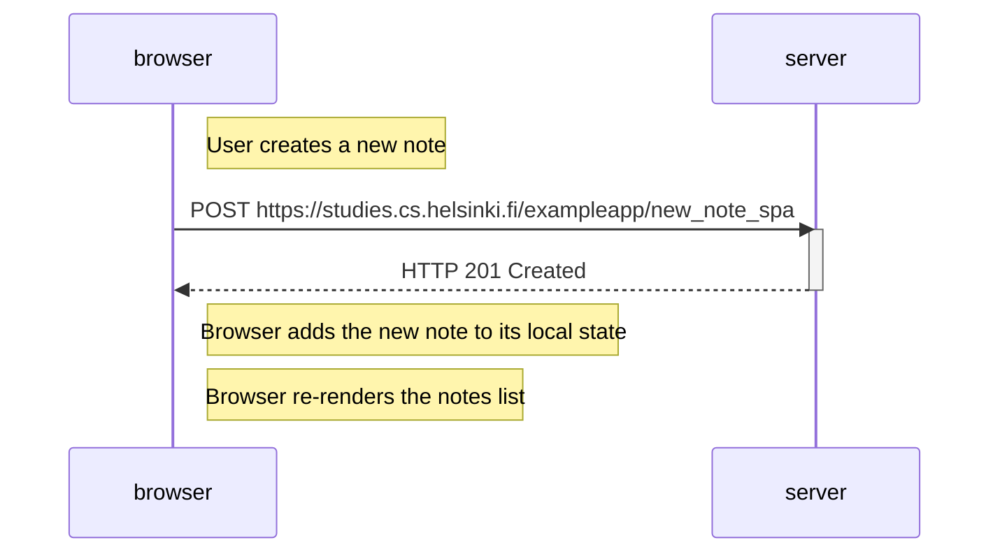

```mermaid
sequenceDiagram
    participant browser
    participant server

    Note right of browser: User creates a new note

    browser->>server: POST https://studies.cs.helsinki.fi/exampleapp/new_note_spa
    activate server
    server-->>browser: HTTP 201 Created
    deactivate server

    Note right of browser: Browser adds the new note to its local state
    Note right of browser: Browser re-renders the notes list
```